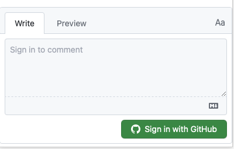
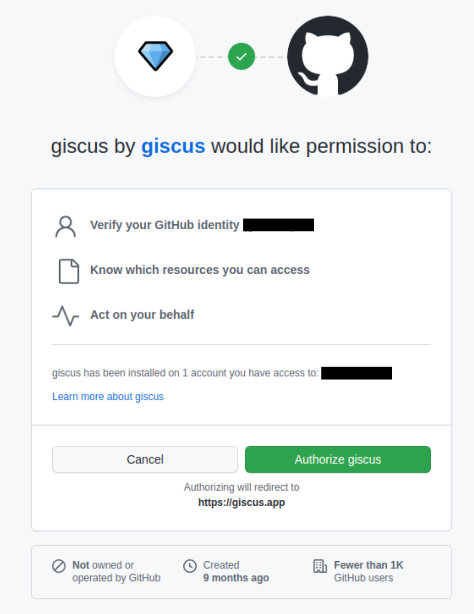
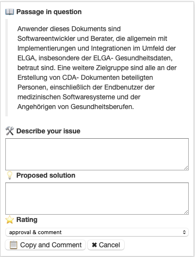
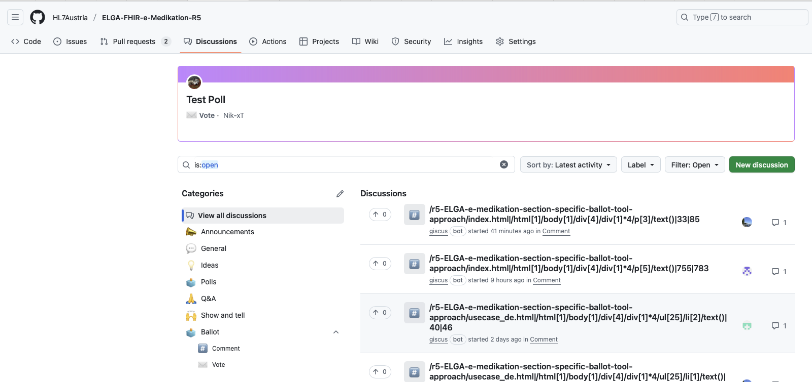
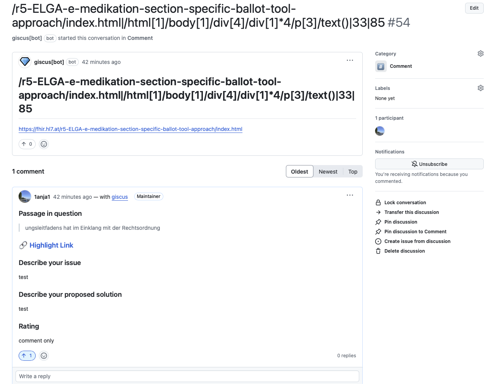
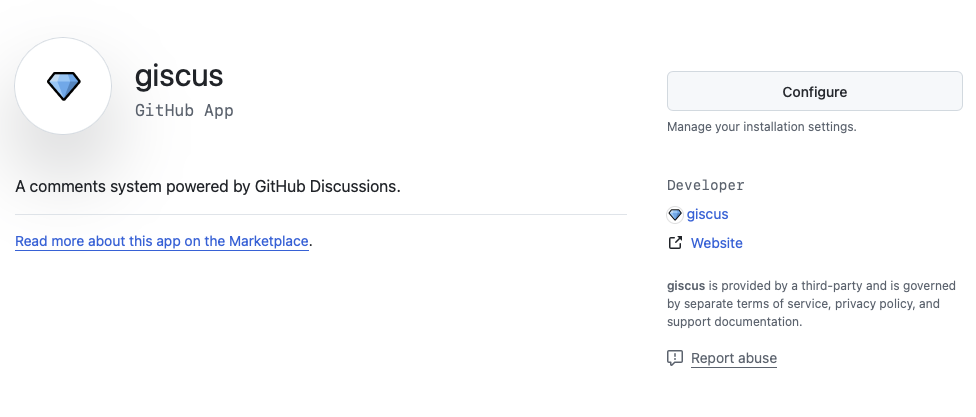
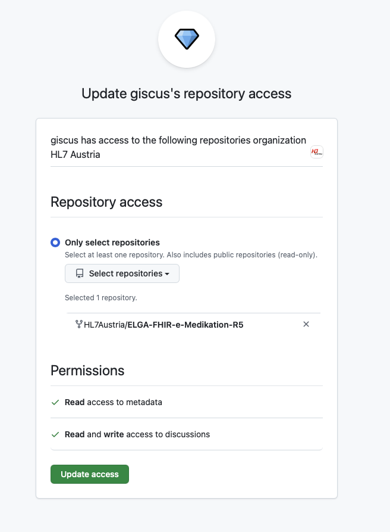
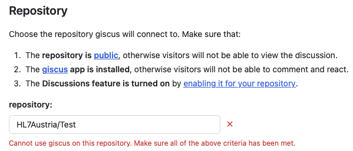

# Balloting Tool

This page describes the new HL7Austria balloting tool. The first section explains how ballot participants can use it. The second section describes the setup for new ballots and the third section shows how the highlight/comment mechanism works.

# Balloting Tool for ballot participants

## Prerequisites
 - Github account
 
## Before first comment
1. Click on a highlighted section that already exists
2. Scroll down to the bottom of the box and press Sign in with Github:

 

4. Sign in with your github account
5. Accept the permissions for giscus before the first use:



## How to write comments

1. Highlight the section you would like to comment on.
2. A form window opens where you can describe the issue, propose a solution and select a rating for your comment from the dropdown:

3.  a) If you highlighted text by accident or change your mind you can cancel the comment process by pressing the "cancel" button

    b.) After you filled out both text fields and selected a rating you can press "copy and comment". 
4. The giscus window opens - here simply paste the contents that were automatically copied by pressing "copy and comment" and press the "Comment" button. 
5. The comment has now been sucessfully recorded. If the page is reloaded it is possible that the highlighted section is not displayed immediately as it can take up to a couple minutes to show up. The comment has been registered and is being updated so **please do not submit it again!** To double check wheter it was submitted you can go to the repository of the IG (all repositories can be found [here](https://github.com/HL7Austria)) and click on "Discussions":
   


The comment should be visible at the top. To see more details click on the discussion. This will look similar to this [example](https://github.com/HL7Austria/ELGA-FHIR-e-Medikation-R5/discussions/54): 



### !Attention! 
 - Highlights usually appear within 1–5 minutes.
 - Selections should be kept as short as possible. Only select what is relevant to your comment. 
 - Only one paragraph or headline can be selected at a time
 - If a slection gives an error try again with a slightly different selction (can happen if bold and regular text try to be selected together)


# Balloting Tool for IG creators
## Discussions Setup
Follow [this guide](https://docs.github.com/en/repositories/managing-your-repositorys-settings-and-features/enabling-features-for-your-repository/enabling-or-disabling-github-discussions-for-a-repository) to enable discussions on the repository that the ballot should happen in.

## Giscus Setup

1. Install github app giscus for your repo using this [link](https://github.com/apps/giscus). Press "configure" and select HL7Austria as the Organization.


3. Select the repository for which giscus should be enabled and request access.


5. Once access is granted go to this [website](https://giscus.app) and enter the repository name. If steps 1 and two were successful a green checkmark will indicate that giscus is enabled an can be used.
   


7. Set the discussion Category to Comment and then copy the following lines:

        data-repo="HL7Austria/ELGA-FHIR-e-Medikation-R5"
        data-repo-id="R_kgDOLhyFQQ"
        data-category="Comment"
        data-category-id="DIC_kwDOLhyFQc4Cev5-"
        
8. These values need to be updated in custom-template/content/assets/js/comment-box.js during the IG setup.


## IG Setup
TBD once established

Ensure that the file UpdateBallotComments.yml exist in ```.github/workflows```

Ensure that this line is included towards the end of fragment-pageend.html: ```<script type="text/javascript" src="assets/js/comment-box.js"></script>```


## Final IG Ballot Checklist
- [ ] GitHub Discussions enabled
- [ ] "Comment" category exists
- [ ] Giscus app installed & configured
- [ ] `comment-box.js` updated with correct repo and repo ID
- [ ] `UpdateBallotComments.yml` workflow exists
- [ ] IG page includes `<script src=".../comment-box.js">`


# Balloting Tool Highlighting Mechanism

Upon creation of a new discussion (by pressing comment in the giscus window) a new discussion is created by the giscus bot. The creation of a new discussion triggers the UpdateBallotComments github action that is defined in ```.github/workflows/UpdateBallotComments.yml``` . 

### discussion id

The balloting tool relies on a unique string — referred to as the discussion ID, giscus term or highlight ID — to link each comment to a specific section of the IG. This string is used by:

Giscus to fetch and identify the correct discussion thread.
The highlighting mechanism to locate and mark the correct passage in the rendered IG.
The term has the following structure:

```[page path] | [compressed XPath] | [startOffset] | [endOffset]```

Each component is separated by a pipe |. For example:

```/r5-ELGA-e-medikation-section-specific-ballot-tool-approach/index.html|/html[1]/body[1]/div[4]/div[1]*4/p[3]/text()|33|85```

To reduce the overall length (and avoid giscus bugs), the XPath portion is compressed using a custom scheme that replaces repeated elements (e.g., /div[1]/div[1]/div[1] becomes /div[1]*3). This compression is essential because:

Giscus imposes a strict character limit on discussion titles. If this limit is exceeded, giscus silently fails to locate or render the associated discussion, without showing any error message. The compression format is reversible and the GitHub Action described below automatically decompresses it when building the comments.json used by the frontend.

### UpdateBallotComments Github Action
Once triggered (manually or via creation of a new discussion) this github action fetches all discussions in the repo that it is located in. The fetched discussions are then transformed into the following format:

```
{
    "commentId": "/r5-ELGA-e-medikation-section-specific-ballot-tool-approach/index.html|/html[1]/body[1]/div[4]/div[1]*4/p[3]/text()|33|85",
    "page": "/r5-ELGA-e-medikation-section-specific-ballot-tool-approach/index.html",
    "startXPath": "/html[1]/body[1]/div[4]/div[1]/div[1]/div[1]/div[1]/p[3]/text()",
    "startOffset": 33,
    "endOffset": 85,
    "url": "https://github.com/HL7Austria/ELGA-FHIR-e-Medikation-R5/discussions/54",
    "createdAt": "2025-05-05T14:24:02Z",
    "number": 54
  },
```

All of these json elements are added to a file and committed to the HL7Austria/ballot-comments repo under the folder discussions-[REPO NAME].

### comment-box.js


#### fetching discussions
When the IG is opened in the browser the comment-box.js file fetches all discussions from ```https://raw.githubusercontent.com/HL7Austria/ballot-comments/main/discussions-[REPO NAME]/comments.json``` and highlights them on the page using the startXPath and the offsets. 

#### clicking a highlighted section
When a highlight is clicked it injects the giscus script with the specific term the discussion was initially created with in order for giscus to be able to fetch the discussion and display the discussion including earlier comments to the user.

#### creating a new comment
If the user highlights text (that has not been highlighted before) the comment-box.js temporarily generates the xpath and offset for that specific section and generates the specific term that is necessary for giscus and the rest of the workflow. The user is presented with a form to describe the problem, describe the solution and select a rating. If the user decides to cancel the process the highlight is not persisted. If the user decides to "copy and comment" the highlight is added only locally. It will only be visible to other users (and in general outside of that page/browser/session/..) if an acutal comment is submitted via the giscus github window. Closing the window and reloading the page will remove temporary highlights. Comments are only persisted if after pressing "Copy and Comment" an actual comment is submitted and the rest of the process as described in the earlier sections runs through. Upon clicking "Copy and Comment" giscus again injects the script with the term the same as when simply clicking a highlight except this time no discussion is found (this is intentional as we are trying to create a new one). The window is empty and the user can simply paste and comment the content that was copied when pressing the button earlier. 

#### copy and comment including "link to highlight feature"
Copy and comment does not only includ the things the user entered but also the headlines necessary for formatting the md comment nicely as well as the highlighted passage (which should not be changed by the user therefore not editable in the form) and a "link to highlight". This is a feature that resembles a browser's "Copy link to highlight" functionality that creates a simple link that will navigate to and highlight a certain passage. This however, only works if the selection is unique on the page and underlies the same limitations as the browser's "Copy link to highlight" that it was modeled after. This feature allows users to quickly jump to the part of the IG that a comment is referring to if the discussion is viewed directly on github. It does not affect the discussion highlight mechanism in any way but is simply a nice to have feature to jump from github directly to the correct page in the IG. 
